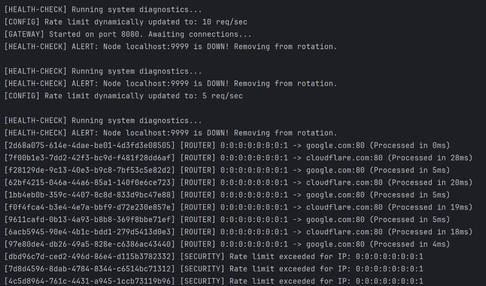
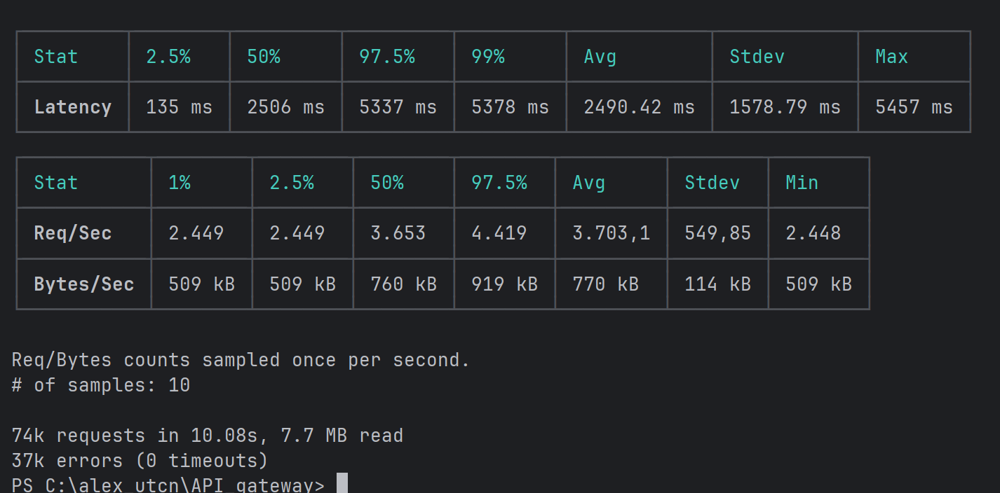

# L7 API Gateway & Load Balancer

A lightweight, multi-threaded Layer 7 API Gateway built entirely from scratch in Java. This project demonstrates core distributed systems concepts, including non-blocking network I/O, concurrent memory management, fault tolerance, and traffic routing, without relying on heavy enterprise frameworks.

## Core Architecture & Features

* **Multi-threaded Connection Handling:** Utilizes Java's `ExecutorService` to offload incoming TCP connections to a dedicated worker pool, preventing main-loop blocking and thread starvation.
* **Token-Bucket Rate Limiting:** Implements a thread-safe rate limiter using `ConcurrentHashMap` and `AtomicInteger` to protect downstream services from volumetric abuse (returns HTTP 429).
* **Dynamic Configuration (Hot Reloading):** A background daemon watches `gateway.properties` for limit changes and applies them instantly to the Rate Limiter without requiring a server restart.
* **Fault-Tolerant Load Balancing:** Evenly distributes incoming HTTP traffic using a Round-Robin algorithm.
* **Active Health Checks:** A background diagnostics thread pings downstream nodes via TCP every 5 seconds, automatically removing unreachable nodes from the rotation (Self-Healing).
* **Observability:** Engineered distributed tracing capabilities by injecting `X-Correlation-ID` (UUID) into incoming requests, generating structured audit logs with precise processing latency tracking.
* **High Performance:** Stress-tested with `autocannon` to handle **3,700+ requests/second** natively on Windows using Java's standard network stack and optimized TCP connection backlogs.

## Tech Stack
* **Language:** Java 17+ (Core APIs: `java.net`, `java.util.concurrent`)
* **Testing:** JUnit 5 for business logic validation.
* **Architecture:** Single Responsibility Principle (SRP), Dependency Injection pattern, Thread-safe Data Structures (`CopyOnWriteArrayList`).

## How to Run

1. Clone the repository and compile the Java files.
2. Ensure `gateway.properties` exists in the root directory (e.g., `rate.limit=50`).
3. Run the `ApiGateway.java` main class. The gateway will start on `localhost:8080`.
4. Send requests via browser or `curl`.
5. **Test Hot Reloading:** Modify `gateway.properties` while the server is running and watch the rate limit adjust dynamically in the console.

## 📸 Project Demo & Logs

**Structured Audit Logging & Health Checks (Console Output)**  
Notice the `X-Correlation-ID` tracking, dynamic config hot-reloading, and background health diagnostics isolating dead nodes.

**Performance Validation (Load Testing)**  
Stress-tested using `autocannon` with 100 concurrent connections over 10 seconds. The gateway successfully routed over 3,700 requests per second with zero dropped connections on a standard Windows blocking I/O stack.

